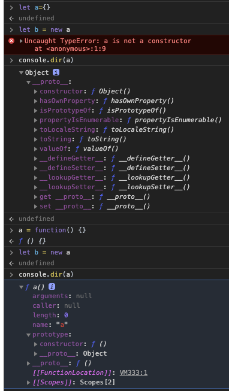
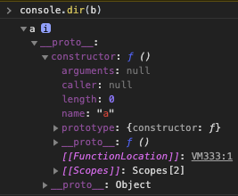
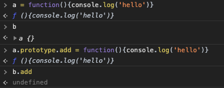
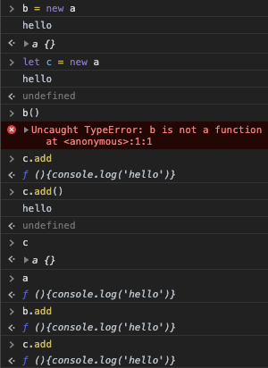
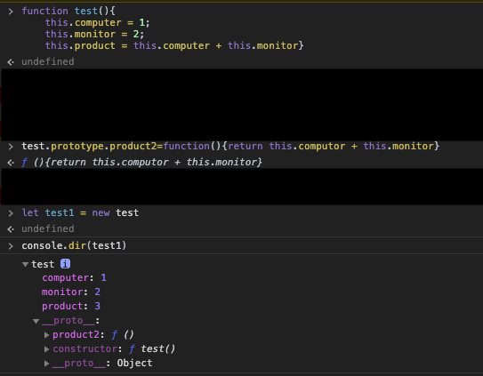

prototype(2020.07.09~)
===
* 자바스크립트는 다른 객체지향의 언어의 클래스 대신에 프로토 타입을 사용합니다.
* 프로토타입으로 상속기능을 흉내낼 수 있습니다.
* ECMA6에는 class문법이 추가되었지만 클래스기반으로 바뀐것은 아닙니다.
* 자바스크립트 유일한 생성자는 개체뿐입니다.
* 각각의 객체는 prototype이라는 은닉속성을 가지는데 자신의 프로토타입이 되는 다른 객체를 가리킵니다.
* 
---
```js
function test(){
    this.computer = 1;
    this.monitor = 2;
    // this.productSum = function (){
    //     return this.computer + this.monitor
    // }
}

test.prototype.productSum = function(){
    return this.computer + this.monitor
}

var emp1 = new test()
var emp2 = new test()

console.log(emp1.computer)
console.log(emp1.monitor)
console.log(emp1.productSum)

console.log(emp2.computer)
console.log(emp2.monitor)
console.log(emp2.productSum)
```
* emp1,2는 각각 3개의 메모리를 사용하여 6개 할당이 됩니다.
* productSum은 실행할때마다 값이 변경되는것이 아니라 하나만 할당되어도 문제가 없는 상황에서 해당 함수를 n개 선언시 n개가 선언되어 메모리 낭비가 심해집니다.
* 객체가 공통적으로 사용하는 프로토 타입을 생성하면 메모리 낭비를 막을 수 있습니다.
* prototype을 사용하면 해당 함수를 실행할때마다 생성되지 않아서 효율적으로 사용할 수 있습니다.
* prototype을 사용하면 프로토타입을 하나 선언할때마다 할당되지 않고 하나로 공유하여 사용합니다.
 
* 위를 보면 a를 Object로 선언 한 후 b에 new로 선언을 하면 생성자 권한이 없어 오류가 발생합니다.
* 아래 a를 함수로 선언한 후 b에 new로 선언을 하면 문제없이 선언이 되었습니다.
* 두개의 dir을 보면 차이를 확인할 수 있습니다.
    * 위의 dir은 prototype이 존재하지 않습니다.
    * 아래를 보면 prototype아래 constructor이 생성됨을 확인할 수 있습니다.

* 위는 선언 되어진 b를 확인할 수 있습니다. proto아래 constructor이 보이는데 이는 a가 선언 되어있습니다. 해당 prototype아래에 보시면 a를 복사하여 생성되었음을 확인 할 수 있습니다.

* a에 값을 생성하고 prototype을 추가하여도 b에는 아무런 영향이 없음을 확인할 수 있습니다.

* b,c에 각각 a를 선언하면 a함수 내부는 하나씩 메모리를 할당하여 생성이 됩니다.
* b,c에 prototype인 add는 하나의 prototype을 공유하여 사용합니다.
---
* 해당함수에 생성자 자격부여.
    * constructor(생성자)가 부여되면 해당 생성자를 통해 객체를 만들어 낼 수 있습니다.
* 함수에 프로토타입과 객체를 생성하여 연결합니다.
    
    * 2가시 상황을 볼 수 있습니다.
        1. 내부에 값을 넣었을때
        2. 프로토타입으로 선언하였을때
    * dir로 확인을 하면 computer,monitor모두 선언 되어 있고 product또한 같이 있음을 확인할 수 있습니다.
    * 아래의 __proto__를 보면 product2가 생성되었고. 아래에보면 consturctor로 test()가 생성되었음을확인할 수 있습니다.