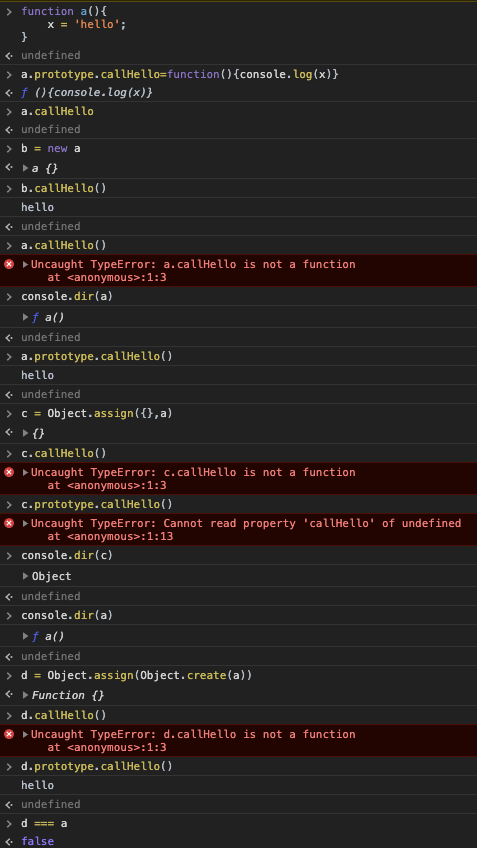
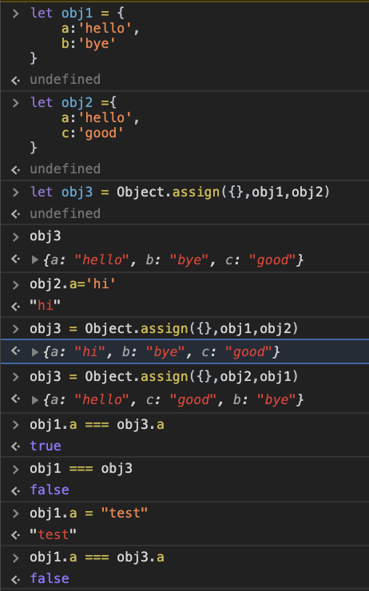
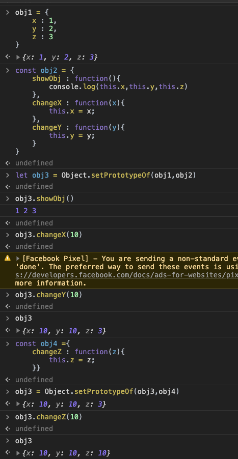

Object
===
### class
---
* javascript에서는 class대신에 키워드가 생겼습니다.
```js
function Health(){
    this.name = name;
}

Health.prototype.showHealth = function(){
    console.log(this.name +"님 안녕하세요.");
}

const h = new Health('kim');
h.showHealth();
```
* 객체를 프로토타입에 두면서 객체를 제너레이트 해줍니다.
* 프로토타입 내부에 있는 속성들을 묶어서 h에 할당한 후 사용합니다.
* 생성자가 없습니다. 
```js
class Health{ //클래스가 아니라 function입니다. 가독성면에서 좋습니다.
    constructor(name, lastTime){
        this.name = name;
        this.lastTime = lastTime;
    }

    showHealth(){ //showHealth는 prototype에 저장되어집니다.
        console.log(`안녕하세요 ${this.name}`);
    }
}

const h = new Health('kim');
h.showHealth();
```
---
### object assign
* new키워드를 이용해서 생성자를 만들때 이질감이 들어서 생성이됩니다.
* create는 prototype기반을 생성하는 역활이라 값을 넣어주어야 사용할 수 있습니다.
```js
const healthObj ={
    showHealth : function(){ //prototype내부에 있습니다.
        console.log(`오늘의 운동시간 : ${this.healthTime}`);
    }
}

// const myHealth1 = Object.create(healthObj); //생성한 후 값을 하나하나 넣어주어야 합니다.
// myHealth.healthTime = '11:20';
// myHealth.name = 'kim';

const myHealth2 = Object.assign(Object.creat(healthObj),{ //생성하면서 객체에 필요한 값을 한번에 넣어줄 수 있습니다.
    name : 'kim',
    healthTime : '11:20'
});

console.log(myHealth2);
```
* Object.assign 은 메소드를 열거 가능한 하나 이상의 객체로부터 대상객체로 속성을 복사할 수 있습니다.
    * 동일한 키가 있을경우 대상 객체의 속성으로 덮어 씌웁니다.
    * 출저의 속성은 이전 출저의 속성과 유사하게 덮어씁니다.
    * 복사되어진 객체는 기존객체와 다른 주소를 가집니다.
    
--- 
### immutable 객체 만들기.
* assign의 객체를 생성한 후 새로운 값을 방출하지만, 내부의 값은 동일합니다.
```js
const preObj = {
    name : 'kim',
    healthTime : '11:20'
}

const myHealth2 = Object.assign({},preObj,{
    'lastTime' : '12:33',
    'name' : 'lee', //키 값이 동일하면 값이 변경됩니다.
    'age' : 90
}); // preObj

console.log(myHealth2);
```

---
### setPrototypeOf and prototype chain
* prototype 객체에만 추가를 시켜줍니다.
* setPrototypeOf 를 이용하여 proto내부에 추가시켜 줍니다.

```js

const healthObj ={
    showHealth : function(){ //prototype내부에 있습니다.
        console.log(`오늘의 운동시간 : ${this.healthTime}`);
    },
    setHealth : function(newTime){
        this.healthTime = newTime;
    }
}

const healthObjChildObj = {
    getAge : function(){
        return this.age
    }
}

const preObj = {
    name : 'kim',
    healthTime : '11:20'
}

const myHealth = Object.setPrototypeOf(preObj,healthObj)

console.log(myHealth1);
```
;
---
### setPrototype Chain
```js
const healthObjChildObj = {
    getAge : function(){
        return this.age
    }
}

const healthObj ={
    showHealth : function(){ //prototype내부에 있습니다.
        console.log(`오늘의 운동시간 : ${this.healthTime}`);
    },
    setHealth : function(newTime){
        this.healthTime = newTime;
    }
}
Object.setPrototypeOf(healthObjChildObj,healthObj);

const childObj = Object.setPrototypeOf({
    age:22
},healthObjChildObj);

childObj.setHealth('11:55');
childObj.showHealth();
console.log(childObj.getAge());
```