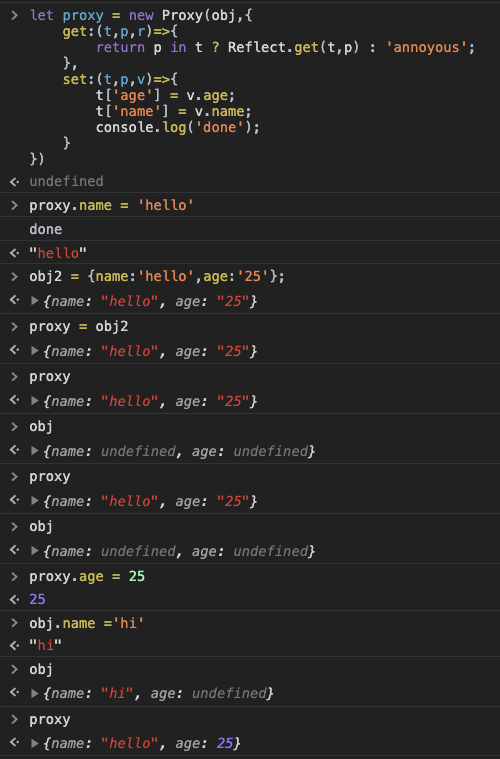
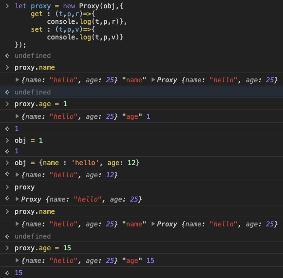
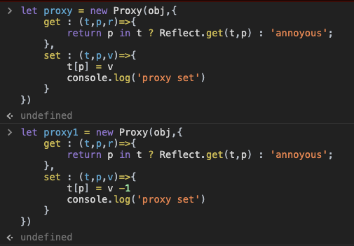
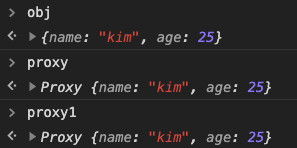
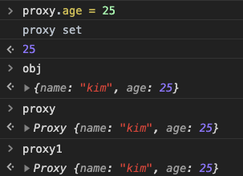
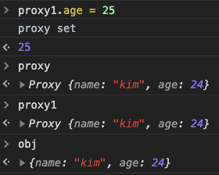
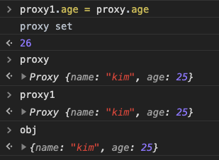

Proxy
===
```js
const myObj = {name : 'name_pre' , changedValue : 0};

let proxy = new Proxy(myObj,{
    get : function(target , property , receiver){ 
        console.log(target,property,receiver);//{name: "name_pre"}name: "name_pre"__proto__: Object "name" Proxy {name: "name_pre"}
        //return target[property];
        Reflect.get(target,property);
    },
    set : function(target,property,value){ //target은 myObj의 name을 지목합니다.
        console.log(target,property,value); //{name: "name_pre"} "name" "hello"
        target['changedValue']++;
        target[property] = value;
    }
});
proxy.name = 'name_after';

console.log(proxy.name) //name_after; change value
console.log(myObj.name) //name_after;

myObj.name = 'hello';

console.log(proxy.name) //hello
console.log(myObj.name) //hello
```
* 프록시 내부에 객체를 넣어서 객체를 숨길 수 있습니다.
```js
let proxy = new Proxy({name : 'name_pre' , changedValue : 0},{
    get : function(target , property , receiver){ 
        console.log(target,property,receiver);//{name: "name_pre"}name: "name_pre"__proto__: Object "name" Proxy {name: "name_pre"}
        return target[property];
    },
    set : function(target,property,value){ //target은 myObj의 name을 지목합니다.
        console.log(target,property,value); //{name: "name_pre"} "name" "hello"
        target['changedValue']++;
        target[property] = value;
    }
});
```

```js
let proxy = new Proxy({name : 'name_pre' , changedValue : 0},{
    get : function(target , property , receiver){ 
        Reflect.get(target,property);
    },
    set : function(target,property,value){ //target은 myObj의 name을 지목합니다.
        console.log(target,property,value); //{name: "name_pre"} "name" "hello"
        target['changedValue']++;
        target[property] = value;
    }
});
```
* loggin,data change를 유용하게 사용할 수 있습니다.
1. 프록시가 obj를 래핑하여 생성이 되었지만 해당 프록시에 다른 객체값을 넣어주면 프록시가 해당 객체값이 됨과 동시에 obj의 값은 undefined로 변경이 됩니다.


2. 프록시를 이용하여 set,get을 이용할 경우 해당 값을 입력할 경우 어떤식으로 입력되어지는 확인했습니다


    * t(target) : 입력되어진 객체,
    * p(property) : 해당 프록시를 사용할때 입력되어지는 키값
    * r(receiver) : 프록시에 저장되어진 객체.
    * v(value) : 변경할 값

3. 프록시는 해당 값을 입력, 프록시1은 해당값에 -1를 해줍니다.

* 프록시를 각각 선언해 줍니다.  

* 각각 입력된 초기 값들입니다.  

* proxy에 값을 변경합니다.  

* proxy1에 값을 변경합니다.  

* proxy1.age에 proxy를 넣어줍니다.
